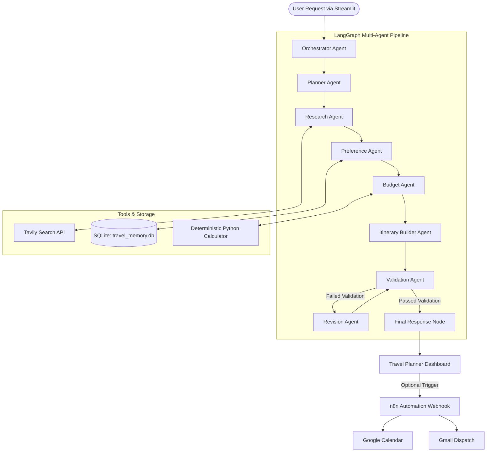

# ✈️ Automated Travel Itinerary Generator

> **Course:** Agentic AI & Automation — Academic Mini-Project  
> **Repository:** [Vedantnawghare/Automated_Travel_Itinerary_Generator-Flexi-Credit](https://github.com/Vedantnawghare/Automated_Travel_Itinerary_Generator-Flexi-Credit)  
> **Deployment Platform:** Streamlit Community Cloud  
> **Core Framework:** LangGraph Multi-Agent State Machine  

---

## 📌 1. Problem Statement
Traditional travel planning involves manually aggregating information from fragmented sources (flight searches, hotel listings, tourism blogs, maps), performing mental arithmetic for budgeting, and repeatedly adjusting schedules when constraints clash.

Existing LLM chatbots generate itineraries through a single, static prompt-response call (`prompt → LLM → output`). Such monolithic chatbots:
- Hallucinate mathematical budgets and cost figures.
- Have no awareness of real-time ground realities or current local travel notices.
- Lack self-correction loops when plans violate user budget or time limits.
- Do not maintain stateful long-term memory of traveler preferences across trips.
- Cannot trigger external workflow automations (such as calendar scheduling or email dispatches).

---

## 🎯 2. Project Objective
To build an **autonomous, multi-agent AI travel itinerary and automation platform** that:
1. Decomposes high-level travel goals into concrete subtasks.
2. Coordinates specialized agents with distinct operational responsibilities.
3. Retrieves verified web research via Tavily without fabricating live facts.
4. Performs deterministic numerical budget computations in Python (avoiding LLM math hallucinations).
5. Synthesizes user preferences with historical memory stored in SQLite.
6. Rigorously validates generated itineraries against budget, duration, and density constraints.
7. Automatically triggers an iterative **self-correction revision loop** when validation fails.
8. Exposes an automation path via an **n8n webhook** to populate Google Calendar and send Gmail notifications.
9. Provides a dedicated, travel-planner dashboard in Streamlit deployable publicly on Streamlit Community Cloud.

---

## 🧠 3. Why This is Genuine Agentic AI
This application is **NOT a simple chatbot or single LLM prompt wrapper**. It implements the foundational Agentic Loop:

$$\text{Perceive} \longrightarrow \text{Think} \longrightarrow \text{Act} \longrightarrow \text{Observe} \longrightarrow \text{Critique} \longrightarrow \text{Respond / Revise}$$

| Concept | How This System Implements It |
| :--- | :--- |
| **Goal Decomposition** | **Planner Agent** parses constraints and splits the trip into subtasks and targeted search queries. |
| **Tool Calling & Actuation**| Specialized agents interact with real tools: **Tavily Tool** (live web search), **Calculator Tool** (deterministic arithmetic), **SQLite Memory**, and **n8n Webhook**. |
| **Memory & Personalization**| **Preference Agent** interfaces with SQLite (`data/travel_memory.db`) to retain past preferences, travel styles, and avoidances across sessions. |
| **Stateful Graph Execution**| Built on **LangGraph**, keeping state (`TravelGraphState`) flowing across typed nodes and conditional edges. |
| **Validation & Self-Correction**| **Validation Agent** critiques the plan; if budget or schedule density checks fail, a conditional branch routes the graph to the **Revision Agent** to optimize and re-validate before final output. |
| **Action & Automation** | Integrates with **n8n** to trigger physical actions in the real world: generating Google Calendar events and delivering email summaries via Gmail. |

---

## 🏛️ 4. Multi-Agent Architecture



### Agent Roles & Responsibilities

1. **Orchestrator Agent:** Ingests the initial request, initializes graph state and execution logging, and monitors transitions.
2. **Planner Agent:** Breaks down travel requirements into operational subtasks, focus areas, constraints, and web research queries.
3. **Research Agent:** Executes queries against Tavily search to fetch authentic attractions, dining spots, and local transit tips with URLs.
4. **Preference Agent:** Reads past user preferences from SQLite, synthesizes them with current selections, and stores an updated profile.
5. **Budget Agent:** Invokes the deterministic calculator tool to estimate intercity transit, accommodation, dining, activities, local transit, and emergency buffers in INR (₹).
6. **Itinerary Builder Agent:** Generates day-wise plans (Morning, Afternoon, Evening) respecting dates/duration, themes, and sensible transit pacing.
7. **Validation Agent:** Evaluates total cost $\le$ budget, day count $=$ duration, absence of avoided items, and activity density.
8. **Revision Agent:** If validation fails, scales budgets and prunes overloaded schedules, then routes back to the Validator (max 2-3 cycles).

---

## 🚀 5. Technology Stack

| Layer | Technology | Purpose |
| :--- | :--- | :--- |
| **User Interface** | Streamlit 1.31+ | Travel planner dashboard with responsive cards, metrics, and tabs |
| **Language** | Python 3.11 / 3.12 | Primary development environment |
| **Orchestration** | LangGraph 0.0.30+ | Stateful multi-agent graph with conditional revision edges |
| **LLM Inference** | Groq (`openai/gpt-oss-120b`) | Reasoning, planning, schedule generation, and validation critique |
| **Web Research** | Tavily Search API | Live web search with real-time citations and source URLs |
| **Deterministic Tool**| Pure Python Math Tool | Calculation of itemized transit, lodging, dining, and buffer costs |
| **Memory** | SQLite (`travel_memory.db`) | Stateful persistence of user travel style, interests, and past trips |
| **Automation** | n8n | Webhook receiver branching to Google Calendar and Gmail |
| **Testing** | pytest 7.4+ | Automated test suite for calculations, validator, and state workflow |
| **Deployment** | Streamlit Community Cloud | Public cloud hosting directly synced with GitHub repository |

---

## 📁 6. Project Directory Structure

```text
Automated_Travel_Itinerary_Generator-Flexi-Credit/
│
├── app.py                      # Main Streamlit dashboard entrypoint
├── requirements.txt            # Python dependencies
├── README.md                   # Primary project documentation
├── .gitignore                  # Git ignore specifications
├── .env.example                # Template for environment credentials
│
├── agents/                     # Specialized AI Agents
│   ├── __init__.py             # Exports agent classes
│   ├── orchestrator.py         # Orchestrator agent & execution interface
│   ├── planner.py              # Goal decomposition & query planning
│   ├── researcher.py           # Web research agent using Tavily
│   ├── preference_agent.py     # User preference interpreter & SQLite sync
│   ├── budget_agent.py         # Budget calculation agent
│   ├── itinerary_agent.py      # Day-wise schedule builder
│   ├── validator.py            # Constraint validation agent
│   └── revision_agent.py       # Self-correction revision agent
│
├── workflow/                   # LangGraph Workflow Definition
│   ├── __init__.py
│   └── travel_graph.py         # StateGraph nodes, edges & conditional loop
│
├── tools/                      # Reusable Tools & External APIs
│   ├── __init__.py
│   ├── calculator.py           # Deterministic Python budget math tool
│   ├── tavily_search.py        # Tavily search tool with demo fallback
│   └── n8n_webhook.py          # HTTP dispatcher for n8n automation
│
├── memory/                     # SQLite Long-Term Memory
│   ├── __init__.py
│   └── sqlite_memory.py        # DB schema, preference read/write/merge
│
├── models/                     # Data Models & Typed State
│   ├── __init__.py
│   └── schemas.py              # Pydantic schemas and payload definitions
│
├── utils/                      # Prompts & Client Helpers
│   ├── __init__.py
│   ├── llm_client.py           # Groq client with JSON extraction & fallback
│   └── prompts.py              # Strict system prompts for each agent
│
├── n8n/                        # n8n Automation Resources
│   ├── README.md               # Step-by-step n8n workflow setup guide
│   └── workflow.json           # Importable n8n workflow definition
│
├── tests/                      # Automated Test Suite (pytest)
│   ├── __init__.py
│   ├── test_budget.py          # Tests for calculation & budget scaling
│   ├── test_validator.py       # Tests for validation checks & density
│   └── test_workflow.py        # End-to-end workflow, dates & revision tests
│
└── docs/                       # Architectural & Technical Documentation
    ├── architecture.md         # Deep-dive architecture and component table
    └── workflow.md             # LangGraph state machine & loop safeguards
```

---

## ⚙️ 7. Environment Variables Configuration

Copy `.env.example` to create your local `.env` file:

```bash
cp .env.example .env
```

| Variable | Description | Example / Default Value | Required? |
| :--- | :--- | :--- | :--- |
| `GROQ_API_KEY` | Your Groq Cloud API Key | `gsk_...` | Optional (Demo mode available) |
| `GROQ_MODEL` | Groq model identifier | `openai/gpt-oss-120b` | Optional |
| `TAVILY_API_KEY` | Tavily Search API Key | `tvly-...` | Optional (Simulated research available) |
| `N8N_WEBHOOK_URL` | Webhook URL from your n8n workflow | `https://your-n8n.com/webhook/travel-itinerary` | Optional (for automation) |
| `DATABASE_PATH` | Path to SQLite database | `data/travel_memory.db` | Auto-configured |
| `DEFAULT_CURRENCY` | Currency code | `INR` | Default |
| `CURRENCY_SYMBOL` | Currency display symbol | `₹` | Default |

> [!NOTE]
> **Safe Fallback / Demo Mode:** If `GROQ_API_KEY` or `TAVILY_API_KEY` are not configured, the application operates in transparent **Demo Mode**, using deterministic algorithms and simulated research.

---

## 💻 8. Running Locally

### Step 1: Clone the Repository
```bash
git clone https://github.com/Vedantnawghare/Automated_Travel_Itinerary_Generator-Flexi-Credit.git
cd Automated_Travel_Itinerary_Generator-Flexi-Credit
```

### Step 2: Create a Virtual Environment & Install Dependencies
```bash
# Windows
python -m venv venv
venv\Scripts\activate

# Linux / macOS
python3 -m venv venv
source venv/bin/activate

# Install requirements
pip install -r requirements.txt
```

### Step 3: Run the Test Suite
```bash
python -m pytest -v
```

### Step 4: Launch the Streamlit Application
```bash
streamlit run app.py
```
Open your browser at `http://localhost:8501`.

---

## ⚡ 9. n8n Automation Setup (Google Calendar & Gmail)

1. Open your self-hosted or cloud **n8n** instance.
2. Click **Add Workflow** > **Import from File** and select `n8n/workflow.json`.
3. Connect your Google account via OAuth2 in the **Google Calendar** and **Gmail** nodes.
4. Copy the Webhook URL and paste it into `.env` as `N8N_WEBHOOK_URL`.
5. In the Streamlit UI, generate an itinerary and click **"⚡ Dispatch to n8n Webhook"**.
6. For step-by-step setup details, see [`n8n/README.md`](n8n/README.md).

---

## ☁️ 10. Deployment to Streamlit Community Cloud

1. Push your repository to GitHub: `https://github.com/Vedantnawghare/Automated_Travel_Itinerary_Generator-Flexi-Credit`.
2. Visit [share.streamlit.io](https://share.streamlit.io) and sign in with GitHub.
3. Click **"New app"** and configure:
   - **Repository:** `Vedantnawghare/Automated_Travel_Itinerary_Generator-Flexi-Credit`
   - **Branch:** `main`
   - **Main file path:** `app.py`
4. Expand **Advanced settings...** > **Secrets** and paste:
   ```toml
   GROQ_API_KEY = "your_actual_groq_key"
   GROQ_MODEL = "openai/gpt-oss-120b"
   TAVILY_API_KEY = "your_actual_tavily_key"
   N8N_WEBHOOK_URL = "https://your-n8n-instance.com/webhook/travel-itinerary"
   ```
5. Click **"Deploy!"**. Streamlit will provision the container, install packages from `requirements.txt`, and provide a public URL (e.g., `https://your-app.streamlit.app`).

---

## 🧪 11. Testing & Validation

The test suite covers:
- Deterministic budget calculations across traveler counts, styles, and transit modes.
- Over-budget detection and mathematical constraint enforcement.
- Budget revision downscaling (`adjust_budget_for_revision`).
- Itinerary validator checks (valid vs. duration mismatch vs. over-budget vs. dense schedules).
- SQLite preference persistence and memory retrieval.
- Date handling (explicit calendar dates vs. duration-only Day 1/Day 2).
- Dynamic revision routing through LangGraph conditional edges.

Run all tests:
```bash
python -m pytest -v
```

---

## 📝 12. Example Inputs & Expected Outputs

### Example Input
- **Destination:** Goa
- **Starting City:** Mumbai
- **Duration:** 4 Days (Explicit dates: `2026-10-15` to `2026-10-18`)
- **Travellers:** 2
- **Budget:** ₹32,000
- **Pace & Style:** Relaxed
- **Interests:** Beaches, Cafes & Dining, Nightlife & Pubs
- **Avoidances:** Overly crowded commercial spots, rushed schedules

### System Execution Flow
1. **Planner:** Identifies 5 subtasks; generates targeted search queries for Goa beaches and cafes.
2. **Researcher:** Gathers verified research citations with URLs.
3. **Preference:** Merges current interests with past memory (enforces late morning start and relaxed pacing).
4. **Budget Agent:** Computes transit (₹9,000), lodging (₹12,600), dining (₹9,600), activities (₹5,600), local transit (₹4,000), buffer (₹2,448) = ₹43,248.
5. **Validator:** Detects ₹43,248 > ₹32,000 $\rightarrow$ **Validation Failed**.
6. **Revision Loop:** Revision Agent dynamically scales lodging and activity allocations to ₹30,720 $\le$ ₹32,000 and removes dense time slots.
7. **Re-Validation:** Status = **PASSED** $\rightarrow$ Proceeds to Final Response Node.
8. **UI Output:** Renders trip summary, cost cards, day-by-day morning/afternoon/evening schedule cards, Tavily citations, and SQLite memory review.

---

## ⚠️ 13. Limitations & Disclaimers
- **Not a Live Booking Engine:** Prices and transit costs are deterministic estimates based on regional averages. The system does not guarantee live airline seat inventory or hotel room availability.
- **API Rate Limits:** Free-tier Groq and Tavily accounts are subject to external rate limits.

---

## 🔮 14. Future Scope
- **Multi-Modal Route Maps:** Embedding interactive Folium/Leaflet maps visualizing GPS waypoints.
- **Collaborative Group Planning:** Multi-user voting on daily itinerary activities.
- **Flight & Hotel API Integrations:** Connecting Amadeus or Skyscanner APIs for real-time ticket checkout.

---

## 👨‍💻 Author & Acknowledgments
- **Developer:** Vedant Nawghare
- **Course:** Agentic AI & Automation
- **Frameworks:** LangGraph, Streamlit, Groq, Tavily, n8n, SQLite
