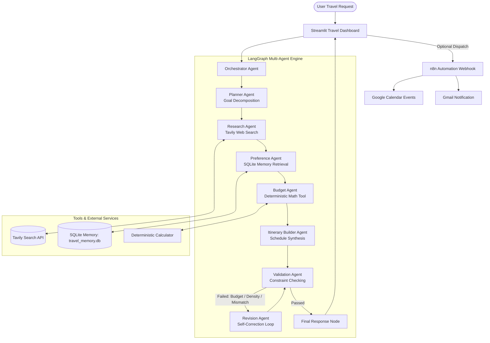

# System Architecture: Automated Travel Itinerary Generator

This document provides a comprehensive technical overview of the multi-agent system architecture, agent responsibilities, tool interfaces, and state management.

---

## 🏛️ High-Level System Architecture

The application adopts a **Hierarchical Multi-Agent Architecture** orchestrated via **LangGraph**, where specialized agents collaborate sequentially with feedback loops:

---

## 🤖 Specialized Agent Specifications

| Agent | Responsibility | Primary Tools & Inputs | Output State |
| :--- | :--- | :--- | :--- |
| **Orchestrator** | Receives request, initializes state machine, coordinates execution pipeline. | User form inputs, LangGraph | `TravelGraphState` |
| **Planner** | Decomposes overall travel goal into actionable subtasks and search queries. | Groq LLM (`openai/gpt-oss-120b`) | `planner_subtasks`, `search_queries` |
| **Researcher** | Performs web research for live attractions, local dining, and logistics. | Tavily Search API (`tools/tavily_search.py`) | `research_results` (title, URL, content) |
| **Preference** | Synthesizes current user interests with stored preferences in SQLite. | SQLite Memory (`memory/sqlite_memory.py`) | `preferences` (avoidances, pace, profile) |
| **Budget** | Computes itemized travel estimates deterministically (zero arithmetic hallucination). | Calculator (`tools/calculator.py`) | `budget_breakdown` (costs, within_budget) |
| **Itinerary Builder**| Builds day-by-day morning, afternoon, evening activities and practical tips. | Groq LLM, Research findings | `itinerary` (day cards, themes, dates) |
| **Validator** | Validates schedule density, duration fidelity, and budget limits. | Deterministic checks + Groq | `validation_result` (is_valid, issues) |
| **Revision** | Refines schedule, scales costs downwards, and resolves validation critiques. | Calculator adjust tool, Groq | Revised `itinerary`, `budget_breakdown` |

---

## 🔄 The Agentic Loop: Perceive → Think → Act → Observe

Unlike simple prompt-response LLM wrappers, this system adheres to the classic agentic cycle:

1. **Perceive:** The Orchestrator and Planner ingest user constraints (destination, dates, budget, style).
2. **Think:** The Planner decomposes goals and designs specific query hypotheses.
3. **Act:** The Research Agent queries external web APIs (Tavily), while the Preference Agent queries local SQLite memory.
4. **Observe:** Intermediate results (web citations, historical styles) are collected into shared graph state.
5. **Think:** The Budget and Itinerary agents build an initial schedule fitting the observed constraints.
6. **Critique & Respond:** The Validation Agent critiques the schedule. If issues arise, a self-correction loop revises the plan until it passes.

---

## 🔒 Security & Credential Isolation

- **Zero Hardcoded Secrets:** Keys are read dynamically through `os.getenv` or `st.secrets`.
- **Git Protection:** `.gitignore` explicitly prevents `.env`, `*.db`, `*.sqlite3`, and `secrets.toml` from being pushed to version control.
- **Graceful Degradation:** When API keys are absent, fallback mechanisms operate without crashing the user interface.
