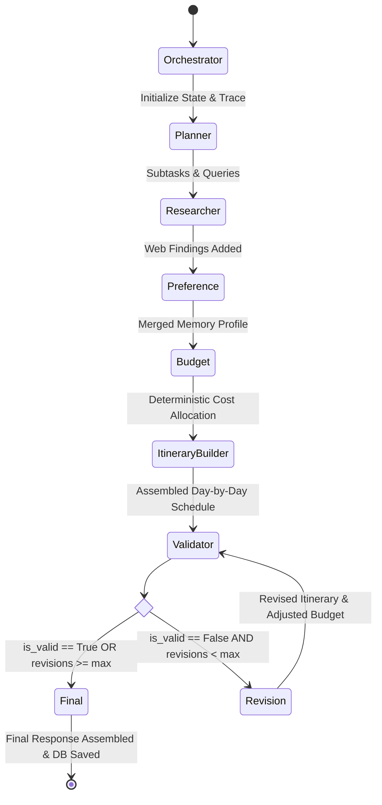

# Workflow Specification: LangGraph Multi-Agent Execution

This document describes the state machine flow, state representation, conditional routing criteria, and self-correction cycles implemented using **LangGraph**.

---

## 🧭 State Machine Flowchart



---

## 📊 State Representation (`TravelGraphState`)

The state is maintained as a typed dictionary passed between nodes:

```python
class TravelGraphState(TypedDict, total=False):
    destination: str
    origin: str
    start_date: Optional[str]
    end_date: Optional[str]
    duration: int
    travellers: int
    budget: float
    interests: List[str]
    travel_style: str
    accommodation_preference: str
    transportation_preference: str
    extra_instructions: str
    email: Optional[str]

    planner_subtasks: List[str]
    search_queries: List[str]
    research_results: List[Dict[str, str]]
    preferences: Dict[str, Any]
    budget_breakdown: Dict[str, Any]
    itinerary: List[Dict[str, Any]]
    validation_result: Dict[str, Any]
    revision_count: int
    max_revisions: int
    execution_trace: List[Dict[str, Any]]
    final_response: Dict[str, Any]
```

---

## 🔀 Conditional Edge Logic

The routing function `route_after_validation(state)` determines the next edge:

```python
def route_after_validation(state: TravelGraphState) -> str:
    val_res = state.get("validation_result", {})
    is_valid = val_res.get("is_valid", True)
    revision_count = state.get("revision_count", 0)
    max_revisions = state.get("max_revisions", 2)

    if is_valid:
        return "valid"    # Routes directly to Final Response Node
    
    if revision_count < max_revisions:
        return "invalid"  # Routes to Revision Agent
    
    return "valid"        # Safe exit if maximum revisions reached
```

### Why this prevents infinite loops:
1. `max_revisions` is hard-bounded (default: 2 iterations).
2. The Revision Agent scales budgets and prunes schedules directly on each pass.
3. If budget or constraints remain unresolvable after 2 attempts, the system completes with transparent warnings displayed in the user interface rather than hanging indefinitely.
